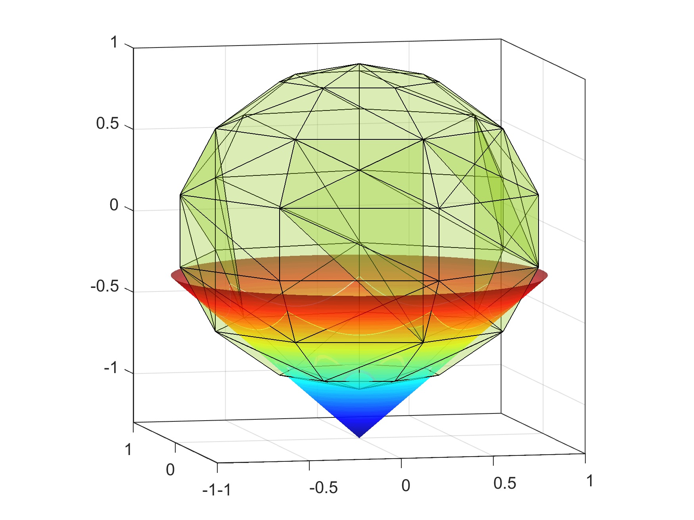

# Second Order Cone Programming

[Second Order Cone Programming (SOCP)](https://en.wikipedia.org/wiki/Second-order_cone_programming) is convex optimization which extends linear programming (LP) with second-order (Lorentz or the ice cream) cones. Search region of the solution is the intersection of an affine
linear manifold with the Cartesian product of second-order cones.

The figure below shows an example feasible region of an SOCP problem with 3 variables.

SOCP appears in a broad range of applications from engineering, control theory and quantitative finance to quadratic programming
and robust optimization. It has become an important tool for financial optimization due to its powerful nature. Interior point
methods (IPM) are the most popular approaches to solve SOCP problems due to their theoretical polynomial complexity and practical performance.

This directory contains demonstrations using NAG's SOCP solver in Python.

## Basic SOCP example

* [A basic example of how to call the SOCP solver in Python](./simple_SOCP.ipynb)

## Interface to CVXPY

[CVXPY](https://www.cvxpy.org/) is a Python-embedded modeling language for convex optimization problems. It allows you to express your problem in a natural way that follows the math, rather than in the restrictive standard form required by solvers.  NAG's SOCP solver can be used from within CVXPY.

* [A classification example using NAG's SOCP from CVXPY](./cvxpy_classification.ipynb)

## Portfolio Optimization as Quadratically Constrained Quadratic Programming (QCQP)

This demonstration is a walk-through of modelling techniques in portfolio optimization using second-order cone programming in the NAG Library. Models in portfolio optimization include

* quadratic programming (efficient frontier)
* quadratically constrained quadratic programming (tev portfolio)
* optimization with objective of fraction of quadratic and linear (the Sharpe ratio).

NAG provides two functions for users to easily define quadratic objective and constraints. Then the second-order cone programming solver can be called directly to solve the problem without any extra effort on reformulation.

* [portfolio_optimization_qcqp.ipynb](./portfolio_optimization_qcqp.ipynb)  Jupyter notebook
* [portfolio_optimization_qcqp.pdf](./static/portfolio_optimization_qcqp.pdf)  Static pdf version
* [portfolio_optimization_qcqp.html](./static/portfolio_optimization_qcqp.html)  Static html version

Users can also transform their QCQP problem into second-order cone programming model by hand. In the following notebook two general functions are enclosed for users to get the principle idea on SOCP reformulation.

* [portfolio_optimization_using_socp.ipynb](./portfolio_optimization_using_socp.ipynb)  Jupyter notebook
* [portfolio_optimization_using_socp.pdf](./static/portfolio_optimization_using_socp.pdf)  Static pdf version
* [portfolio_optimization_using_socp.html](./static/portfolio_optimization_using_socp.html)  Static html version

## Robust linear programming in portfolio optimization using the NAG Library

A mean-variance model with probability constraint using randomly generated data.

* [robust_lp.ipynb](./robust_lp.ipynb) Jupyter Notebook
* [robust_lp.html](./static/robust_lp.html) Static html version

## Data

* [stock_price.pkl](./data/stock_price.pkl) - pickled data file contains daily prices of 30 stocks in DJIA from March 2018 to March 2019. It is used to estimate out-of-sample expected return and covariance matrix.
* [djia_close_price.csv](./data/djia_close_price.csv) - CSV version of daily prices of 30 stocks in DJIA from March 2018 to March 2019.

## Poster

A 2019 poster discussing NAG's SOCP functionality is [available on the NAG website](https://www.nag.com/market/posters/socp.pdf)

# Obtaining the NAG Library for Python

 * Instructions on [how to install the NAG Library for Python](../Readme.md#install)
 * Instructions on [how to run the Jupyter notebooks in the Repository](../Readme.md#jupyter)

<!-- Instructions for how to download, install and license the NAG Library for Python can be found at https://github.com/numericalalgorithmsgroup/NAGPythonExamples#nag-library-for-python-installation-->
